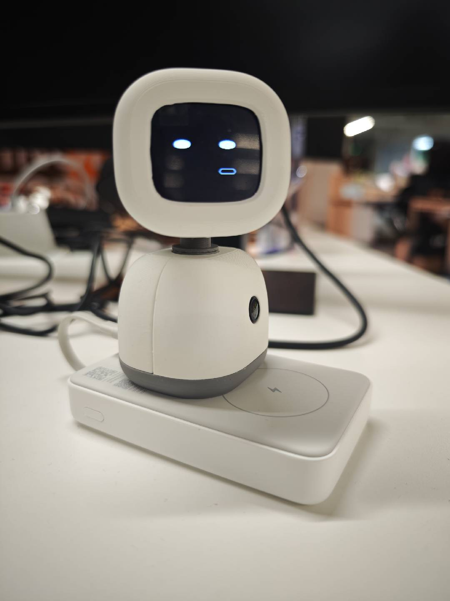

# Brufik

[English](README.md)

**本仓库中的硬件设计部分遵循 [CERN-OHL-S-2.0](mechanical/LICENSE)，软件部分遵循 [GPL-3.0](firmware/LICENSE)。**

**Brufik** 是一款开源桌面机器人：Seeed XIAO ESP32S3 Sense + 屏 + 舵机 + 麦 + 喇叭。语音与画面走自建后台 [open-deskbot-service](https://github.com/OpenDeskBot/open-deskbot-service)。



---

## 一、开箱即用

1. 路由器或手机热点设为 **`deskbot_wifi` / `hello2026`**（与固件默认一致，见 [`firmware/deskbot_config.h`](firmware/deskbot_config.h)）。
2. 给机器人上电，自动连上该 WiFi 并访问语音后台后即可使用（对话、表情、头部动作）。
3. 若需改用家里 WiFi：烧录前改 `deskbot_config.h` 里的 `WIFI_DEFAULT_*` 和 `DESKBOT_WS_*`；或连热点 **`Deskbot_Rom`** → **`http://192.168.4.1/`** 配网。

---

## 二、本地开发者

**需要：** USB、[PlatformIO](https://platformio.org/)，串口 `dialout` 权限。

烧录前编辑 [`firmware/deskbot_config.h`](firmware/deskbot_config.h)：`WIFI_DEFAULT_*`、`DESKBOT_WS_HOST`、`DESKBOT_WS_PORT`。

```bash
git clone https://github.com/OpenDeskBot/open-deskbot-hardware.git
cd open-deskbot-hardware
./flash_rom.sh all
```

| 命令 | 说明 |
|------|------|
| `./flash_rom.sh build` | 编译 |
| `./flash_rom.sh upload [端口]` | 烧录 |
| `./flash_rom.sh log [端口]` | 串口监视 |
| `./flash_rom.sh all [端口]` | 烧录 + 监视 |

后台部署见 [open-deskbot-service](https://github.com/OpenDeskBot/open-deskbot-service)。固件 WebSocket：**`/asr_chat`**。

调试：连上 WiFi 后浏览器可开 `http://<设备IP>/` 看摄像头（可选）。

---

## 三、自行组装

### 元器件与采购关键词

| 部件 | 说明 | 搜索关键词（淘宝/嘉立创等） |
|------|------|---------------------------|
| 主控 | 带摄像头模组 + **板载麦克风**（Sense 扩展板上，**无需另购**） | `Seeed XIAO ESP32S3 Sense`、`Seeed Studio XIAO ESP32S3 Sense` |
| 镜头 | **OV2640** 用；广角 **120°**；**同面**（勿买异面）；长度 **25 mm** | `OV2640 镜头 120度 同面 25mm` |
| 屏幕 | 1.83 寸 SPI，**ST7789** 240×284 | `微雪 1.83寸 LCD`、`Waveshare 1.83 LCD Rev2`、`ST7789 240x284` |
| 舵机 | **一大一小**：俯仰用大舵机，水平用 **2g 舵机** | `2g 舵机`、`微型舵机 2g`；大舵机可用 `SG90` / `9g 舵机` 等 |
| 功放 | I2S | `MAX98357A`、`MAX98357 模块` |
| 喇叭 | **2011** 腔体喇叭 | `喇叭 2011`、`2011 喇叭`、`8Ω 2011 扬声器` |
| 杜邦线 / 细线 | 信号与电源 | `杜邦线`、`硅胶线 26AWG` |
| 电源 | 5V 给舵机（≥1A），3.3V 给板子/屏 | `5V 1A 电源模块`、`USB 5V` |
| PCB | 本项目提供一块扩展 **PCB**，可简化接线；**不用 PCB 也可自行飞线焊接** | — |

### 组装说明与参考图

- **图文说明书：** [`mechanical/说明书1.02PDF.pdf`](mechanical/说明书1.02PDF.pdf)
- **零件全图：** [`mechanical/parts-overview.png`](mechanical/parts-overview.png)
- **基本组装完成（未装外壳）：** [`mechanical/assembly-without-shell.png`](mechanical/assembly-without-shell.png)
- **未装外壳侧面：** [`mechanical/assembly-side-no-shell.png`](mechanical/assembly-side-no-shell.png)

### 接线（XIAO 丝印 → 外设）

> 微雪图纸上的 **IO8 / IO3** 指 **ESP32 GPIO 号**，不是丝印 **D8 / D3**。

| 外设 | 信号 | 接 XIAO 焊盘 | 备注 |
|------|------|--------------|------|
| **LCD** | MOSI / SCK / CS / DC | **D10 / D8 / D1 / D2** | SPI |
| **舵机 左右 (X)** | PWM | **D7** | 小 2g 舵机 |
| **舵机 上下 (Y)** | PWM | **D6** | 大舵机 |
| **MAX98357** | DIN / BCLK / LRC | **D0 / D5 / D4** | I2S → 2011 喇叭 |
| **麦克风** | PDM | **板载**（ESP32S3 Sense 主板上） | 无需外接 INMP441 |
| **舵机电源** | 5V / GND | 独立 5V≥1A | 与逻辑共地 |

引脚宏定义见 [`firmware/deskbot_config.h`](firmware/deskbot_config.h) 硬件段。组装完成后按第二节烧录、配网。

---

## 许可证

| 范围 | 协议 | 文件 |
|------|------|------|
| 硬件设计（[`mechanical/`](mechanical/)） | CERN-OHL-S-2.0 | [`mechanical/LICENSE`](mechanical/LICENSE) |
| 软件（[`firmware/`](firmware/) 等） | GNU GPL v3.0 | [`firmware/LICENSE`](firmware/LICENSE) |
