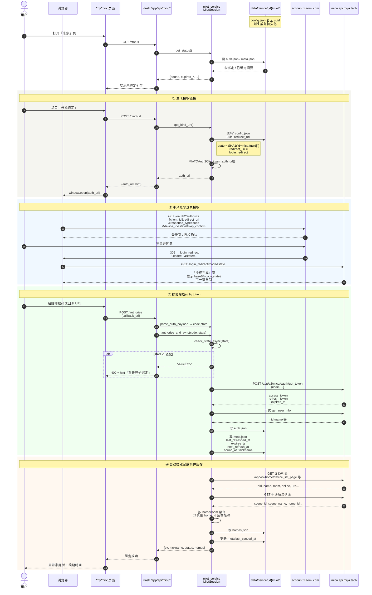
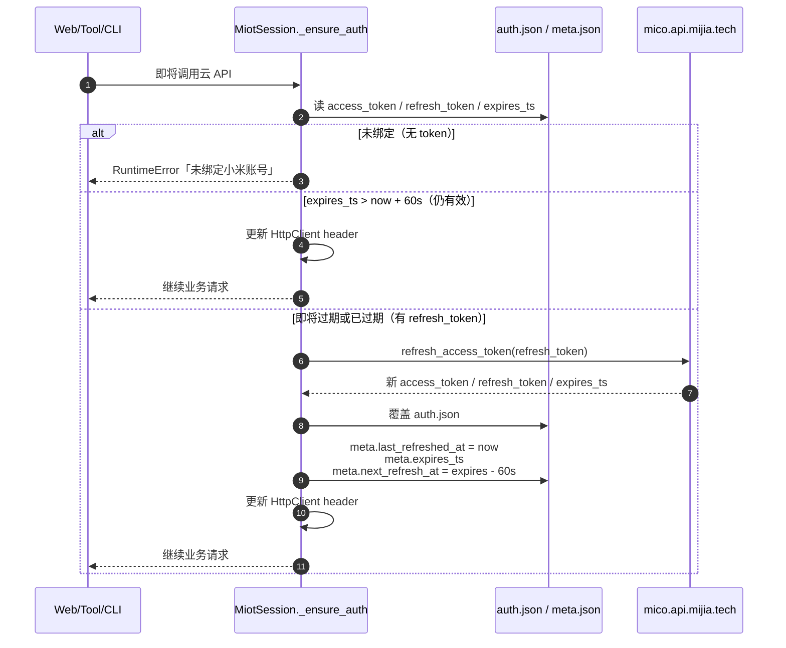
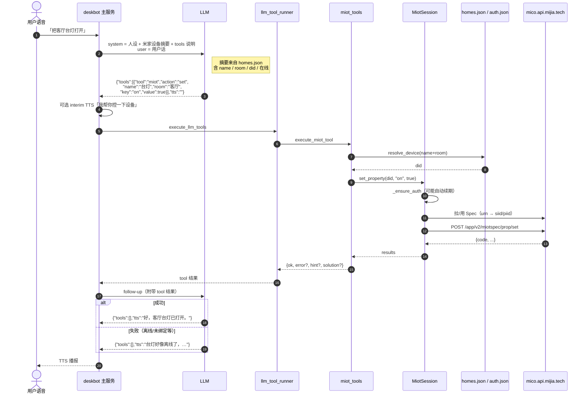
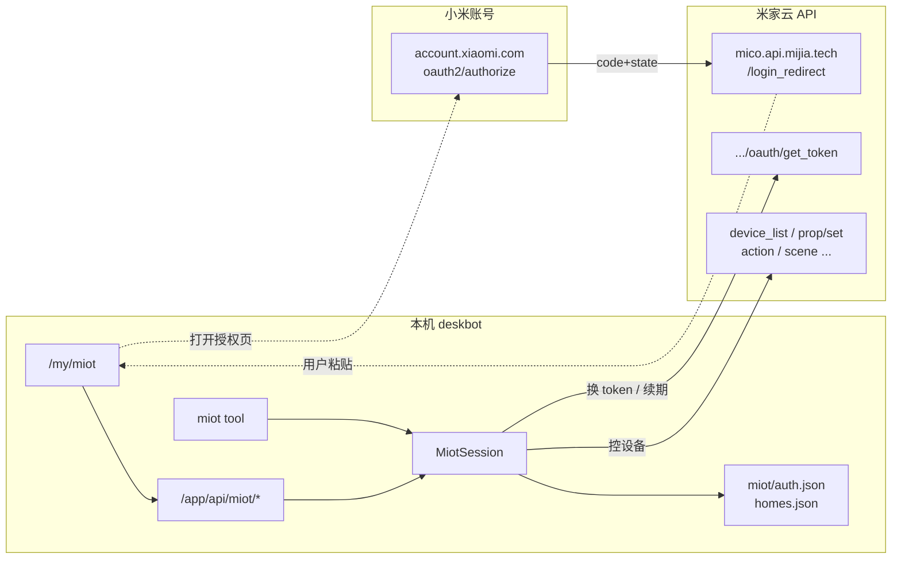

# 米家（MIoT）接入说明

本文说明 deskbot 如何通过 **miloco-miot SDK** 接入米家云：鉴权交互、域名分工、常见业务 API、本地落盘、Web 绑定、以及 LLM Agent Tool 调用。

> 许可：上游 [xiaomi-miloco](https://github.com/XiaoMi/xiaomi-miloco) / miloco-miot **仅限非商业用途**。详见上游 LICENSE。

---

## 1. 整体架构

```
用户（语音 / 网站）
        │
        ▼
┌───────────────────┐     JSON tools      ┌─────────────────┐
│ deskbot LLM 对话   │ ─────────────────► │ miot tool       │
│ + system prompt   │ ◄───────────────── │ miot_tools.py   │
│ （设备摘要）       │     ok/error/hint   └────────┬────────┘
└───────────────────┘                              │
        │                                          ▼
        │ Web「米家」页                    ┌─────────────────┐
        └───────────────────────────────► │ miot_service.py │
                    OAuth 绑定 / 同步      │ MiotSession     │
                                          └────────┬────────┘
                                                   │ HTTPS + access_token
                                                   ▼
                                          米家云 API（见 §2）
```

| 层级 | 路径 | 职责 |
|------|------|------|
| CLI | `iotctl/`（`miot-ctl`） | 独立命令行，便于调试 |
| Session | `iotctl/miot_ctl/session.py` | OAuth、HTTP、Spec、家庭树同步 |
| 服务封装 | `miot_service.py` | 按设备目录持久化、续期状态、prompt 摘要 |
| Agent Tool | `miot_tools.py` + `llm_tool_runner.py` | LLM `tools` 分发执行 |
| Web | `/my/miot` + `/app/api/miot/*` | 友好绑定与设备树展示 |

设备级数据目录：

```
data/device/{device_id}/miot/
├── auth.json      # access_token / refresh_token / expires_ts
├── meta.json      # 上次续期、有效期、下次续期、昵称、同步时间
├── config.json    # uuid、cloud_server、redirect_uri
├── homes.json     # 家庭 → 房间 → 设备 + 场景缓存
└── cache/         # Spec 等 SDK 缓存
```

环境变量 `MIOT_CTL_HOME` 可覆盖 CLI 默认数据目录；deskbot 服务侧固定用上述设备目录。

---

## 2. 域名分工

| 用途 | 域名 / URL | 说明 |
|------|------------|------|
| 用户登录授权 | `https://account.xiaomi.com/oauth2/authorize` | 浏览器打开，选账号并同意 |
| 换 token / 业务 API 主机（中国大陆） | **`https://mico.api.mijia.tech`** | 默认 `cloud_server=cn` |
| 换 token / 业务 API（海外） | `https://{区域}.mico.api.mijia.tech` | `de` / `us` / `sg` / `ru` / `i2` 等 |
| OAuth 回调展示页（推荐） | `https://mico.api.mijia.tech/login_redirect` | 展示可复制授权码（base64 JSON） |
| 旧回调（不推荐） | `https://127.0.0.1` | 本机无服务，页面「无法访问」属正常，只能抄地址栏 |

SDK 常量摘要：

- `OAUTH2_API_HOST_DEFAULT = "mico.api.mijia.tech"`
- `OAUTH2_CLIENT_ID = "2882303761520431603"`（Miloco / mico 开放客户端）
- `PROJECT_CODE = "mico"`

**要点：** 登录在 `account.xiaomi.com`；拿到 `code` 之后，换 token 与控设备都在 `mico.api.mijia.tech`（或区域前缀主机），请求携带 `access_token`。

可选 MQTT（本集成当前以 HTTP 云控为主）：`*.ha.mqtt.io.mi.com:8883`。

---

## 3. 鉴权交互流程

### 3.1 时序图（详细）

#### A. 首次绑定（OAuth 授权码模式）



#### B. Token 自动续期（任意业务调用前）



主动续期（不控设备）：`GET /app/api/miot/status?refresh=1` → `ensure_fresh_token()`。

#### C. 语音控设备（绑定之后）



#### D. 参与方与域名对照



### 3.2 关键步骤说明

1. **绑定入口**  
   - Web：`POST /app/api/miot/bind-url` → 返回 `auth_url`  
   - CLI：`./miot-ctl auth bind`

2. **state**  
   - 由设备 uuid 派生（SHA1），同一 `config.json` 的 uuid 下可校验回调 `state`。  
   - `state` 不匹配时需重新「开始绑定」，勿复用旧回调。

3. **回调内容**  
   - 官方页会给出 base64：`{"code":"...","state":"..."}`  
   - 也支持粘贴完整 URL（含 `code` / `state`）。

4. **换 token**  
   - `https://mico.api.mijia.tech/app/v2/mico/oauth/get_token`  
   - 落盘后 `meta.json` 记录：  
     - `last_refreshed_at`：上次续期时间  
     - `expires_ts`：access_token 有效至  
     - `next_refresh_at`：建议下次续期（有效期前约 60 秒）

5. **自动续期**  
   - 任意 API / tool 调用前 `_ensure_auth()`：若距过期不足 60 秒，用 `refresh_token` 刷新并写回磁盘。  
   - Web「立即续期」：`GET /app/api/miot/status?refresh=1`。

6. **解绑**  
   - 删除 `auth.json` 等绑定态；语音侧不再控米家，直至重新授权。

### 3.3 Web API 一览

| 方法 | 路径 | 说明 |
|------|------|------|
| GET | `/app/api/miot/status` | 绑定态、续期时间；`?refresh=1` 主动续期 |
| POST | `/app/api/miot/bind-url` | 生成授权链接 |
| POST | `/app/api/miot/authorize` | body: `callback_url` 或 `code`+`state`；成功后自动 sync |
| POST | `/app/api/miot/sync` | 刷新家庭/设备/场景缓存 |
| POST | `/app/api/miot/unbind` | 解绑 |
| GET | `/app/api/miot/homes` | 读本地 `homes.json` |

页面：`/my/miot`（侧栏「米家」）。

---

## 4. 常见业务 API 路径

均相对于业务主机 `https://mico.api.mijia.tech`（中国大陆），请求需有效 `access_token`。

| 能力 | 路径 |
|------|------|
| 换 token | `/app/v2/mico/oauth/get_token` |
| UID | `/app/v2/oauth/get_uid_by_unionid` |
| 家庭 | `/app/v2/homeroom/gethome` |
| 房间设备分页 | `/app/v2/homeroom/get_dev_room_page` |
| 设备列表 | `/app/v2/home/device_list_page` |
| 读属性 | `/app/v2/miotspec/prop/get` |
| 写属性 | `/app/v2/miotspec/prop/set` |
| 调动作 | `/app/v2/miotspec/action` |
| 手动场景列表 | `/app/appgateway/miot/appsceneservice/AppSceneService/GetManualSceneList` |
| 执行场景 | `/app/appgateway/miot/appsceneservice/AppSceneService/NewRunScene` |
| 图标配置等 | `/app/v2/productconfig/get_icon` 等 |

### 4.1 Spec 与属性 key

控制前会按设备 URN 解析 MIoT Spec（缓存到 `miot/cache/`）。

调用方可使用：

- **友好名** `type_name`：如 `on`、`brightness`、`color-temperature`
- **iid**：`prop.{siid}.{piid}` / `action.{siid}.{aiid}`

写属性值类型会做简单推断：`true/false/on/off` → 布尔，纯数字 → 数值，其余 → 字符串。

场景对象在 SDK 中通常只有 `home_id` / `room_id`，**没有** `home_name`；本仓库在同步时用设备列表反查名称。

### 4.2 常见设备侧错误码（摘要）

| code | 含义 | 用户侧建议 |
|------|------|------------|
| -704042011 | 设备离线 | 通电并连 Wi-Fi，米家 App 确认在线 |
| -704042001 / -704090001 | 未找到设备 | 刷新设备列表或重新绑定 |
| -704040003 / -704040005 | 属性/方法不存在 | 先 `spec` 看能力 |
| -704030023 | 属性不可写 | 可能是只读状态 |
| -704220043 | 属性值不正确 | 开关用 bool，亮度用数字 |
| -704012906 | 认证失败 | 网站「米家」重新绑定 |
| -704083036 | 操作超时 | 确认在线后重试 |

成功码常见：`0`、`-702000000`、`-702010000`。

---

## 5. Agent Tool：`miot`

### 5.1 接入位置

- 声明：`llm/utils.py` → `llm_tools_prompt_appendix()`
- 设备摘要：`llm_miot_prompt_appendix(device_id)` → 注入每轮 system prompt（家庭/房间/在线设备精简列表）
- 执行：`application/llm_tool_runner.py` → `tool == "miot"`（别名 `mihome` / `mijia`）
- 实现：`miot_tools.py` → `execute_miot_tool`
- 过渡语：`tool_interim_tts.py` →「我帮你控一下设备」

约定与其它工具相同：LLM 返回

```json
{"tools":[{"tool":"miot","action":"..."}],"tts":""}
```

服务端执行后把结果喂回 LLM，最终再输出 `tools:[]` + 口语 `tts`。

### 5.2 action 一览

| action | 作用 | 主要参数 |
|--------|------|----------|
| `status` | 授权/续期状态 | — |
| `sync` | 刷新家庭树缓存 | — |
| `list` | 设备列表 | `online` / `live` |
| `scenes` | 场景列表 | `live` |
| `get` | 设备详情 | `name` / `room` / `did` |
| `spec` | 能力列表 | 同上 |
| `props` | 读属性 | `keys` 或 `key`；省略则尽量读全部可读属性 |
| `set` | 写属性 | `key` + `value` |
| `action` | 调动作 | `key` + `args` |
| `run_scene` | 跑场景 | `scene_name` 或 `scene_id` |

设备解析优先 **名称**，重名加 **room**，或直接 **did**。

### 5.3 调用示例

```json
{"tools":[{"tool":"miot","action":"list","online":true}],"tts":""}

{"tools":[{"tool":"miot","action":"set","name":"台灯","key":"on","value":true}],"tts":""}

{"tools":[{"tool":"miot","action":"set","name":"台灯","room":"客厅","key":"brightness","value":40}],"tts":""}

{"tools":[{"tool":"miot","action":"props","name":"空调","keys":["on","target-temperature"]}],"tts":""}

{"tools":[{"tool":"miot","action":"spec","name":"台灯"}],"tts":""}

{"tools":[{"tool":"miot","action":"action","name":"音箱","key":"play-text","args":["你好"]}],"tts":""}

{"tools":[{"tool":"miot","action":"run_scene","scene_name":"回家模式"}],"tts":""}
```

失败时结果形如：

```json
{
  "tool": "miot",
  "action": "set",
  "ok": false,
  "error": "...",
  "hint": "...",
  "solution": "...",
  "need_bind": false
}
```

LLM 应把 `error` / `hint` 用口语告诉用户（例如未绑定则引导去网站「米家」页）。

### 5.4 Prompt 里放什么

每轮对话会注入精简摘要（在线优先，设备数有上限），例如：

- 是否已绑定、token 是否有效、续期时间
- 家庭 / 房间 / 设备名 + did + 在线标记
- 部分手动场景名

未绑定时提示用户去 Web 绑定，并避免盲目调用控制类 action（`status` 除外）。

---

## 6. CLI 快速对照

```bash
cd service/src/deskbot_server/iotctl
bash install.sh

./miot-ctl auth bind
./miot-ctl auth authorize "<授权码或回调URL>"
./miot-ctl auth status
./miot-ctl device list
./miot-ctl device spec <did>
./miot-ctl device set <did> on true
./miot-ctl device props <did> brightness
./miot-ctl device action <did> play-text "你好"
./miot-ctl scene list
./miot-ctl scene run <scene_id>
```

deskbot 服务内请优先走 `MiotSession` / `miot_service`，不要用 subprocess 调 CLI。

---

## 7. 依赖与安装

```bash
cd service
# HTTP 依赖已写入 pyproject；SDK wheel 需本地安装：
.venv/bin/pip install --no-deps src/deskbot_server/iotctl/wheels/miloco_miot-*.whl
.venv/bin/pip install 'aiohttp>=3.14.1' 'aiofiles>=25.1.0' 'cryptography>=44.0.0' 'pydantic>=2.13.4'
```

或在 `iotctl/` 下执行 `bash install.sh`（独立 venv，适合纯 CLI）。

修改 `iotctl` / `miot_*.py` 后需 **重启** deskbot web（5050）与主服务，否则仍可能跑旧代码。

---

## 8. 排障速查

| 现象 | 处理 |
|------|------|
| 跳到 `127.0.0.1` 打不开 | 旧 redirect；现默认官方 `login_redirect`。也可直接复制地址栏 URL 完成绑定 |
| `state 不匹配` | 重新「开始绑定」，勿用旧授权码 |
| `'MIoTManualSceneInfo' has no attribute 'home_name'` | 旧代码 bug，已改为用 home_id 反查；请重启服务 |
| sync / 控制 400 | 看返回 JSON 的 `error`/`hint`；确认已绑定且 token 有效 |
| 控制成功但无反应 | 看 `code` / `code_msg`（常为离线） |
| 语音不调工具 | 确认该 `device_id` 已绑定米家，且 prompt 中有设备摘要 |

---

## 9. 相关代码索引

| 文件 | 内容 |
|------|------|
| `iotctl/miot_ctl/session.py` | OAuth、设备/属性/动作/场景、`sync_homes` |
| `iotctl/miot_ctl/util.py` | 数据路径、值推断、错误码、spec 查找 |
| `miot_service.py` | 设备目录、续期展示、家庭缓存、prompt、错误 hint |
| `miot_tools.py` | LLM tool 实现 |
| `application/llm_tool_runner.py` | tool 分发 |
| `llm/utils.py` | tools 说明 + 静态上下文拼接 |
| `web/templates/app2c/miot.html` | 绑定 UI |
| `web/blueprints/app_bp.py` | `/app/api/miot/*` |
| `web/blueprints/app2c_bp.py` | `/my/miot` 页面路由 |
